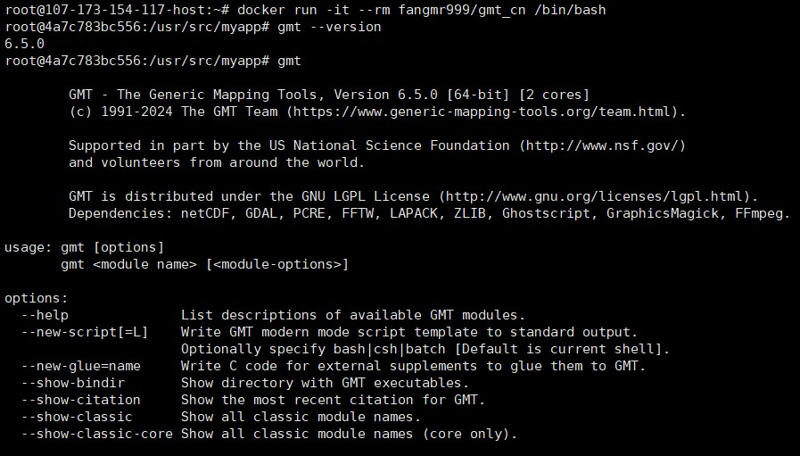

# GMT-Docker
# [GenericMappingTools](https://github.com/GenericMappingTools/gmt.git)的 Docker 镜像

## [ENGLISH](README_EN.md)

**基础镜像:** Ubuntu 22.04

**GMT 版本:** 6.5.0

**已构建的镜像:** 

​	[gmt_cn](https://hub.docker.com/r/fangmr999/gmt_cn)	

如果你需要更改或者新增什么东西，可以修改`Dockerfile`文件，然后自己重新构建镜像

## 如何构建镜像:

1、克隆这个方法到你的服务器

```shell
git clone https://github.com/raingnight/GMT-Docker.git
```

2、构建Docker镜像

```
docker build --platform linux/arm64 -t gmt_arm64:6.5.0 .
```


## 如何使用镜像：

1、拉取镜像

```shell
docker pull fangmr999/gmt_cn:latest
```

2、启动容器

```shell
docker run -it --rm fangmr999/gmt_cn /bin/bash
```

3、测试GMT指令

```shell
gmt --version
```

**提示**

本镜像默认的工作目录是 

```shell
/usr/src/myapp
```


### 使用截图


